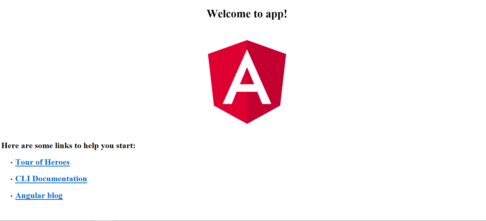

# Prerequisites
1.  [nodejs](https://nodejs.org/en/)
2.  [Visual Studio Code](https://code.visualstudio.com/download)

# Objective
*   Bootstrap Angular App 
*   Understand various Angular files
*   

# Install Angular CLI
The Angular CLI is a tool to initialize, develop, scaffold and maintain Angular applications. [wiki](https://github.com/angular/angular-cli/wiki)

The following command installs the Angular CLI globally
> npm install -g @angular/cli

# New Project
Generating and serving an Angular project via a development server Create and run a new project:
* ng new my-project
* cd my-project
* ng serve

# Understand package.json
```json
  "scripts": {
    "ng": "ng",
    "start": "ng serve",
    "build": "ng build --prod",
    "test": "ng test",
    "lint": "ng lint",
    "e2e": "ng e2e"
  }
```
Add `--open` to start script. This will open the url in default browser. 
```json
  "scripts": {
    "ng": "ng",
    "start": "ng serve --open",
    "build": "ng build --prod",
    "test": "ng test",
    "lint": "ng lint",
    "e2e": "ng e2e"
  }
```
Now, `npm start` will start the angular app and also open the URL in default browser. npm supports the "scripts" property of the package.json file. [Here](https://docs.npmjs.com/misc/scripts) is the complete list.

Additionally, arbitrary scripts can be executed by running npm run build. 

Finally, you should following output


